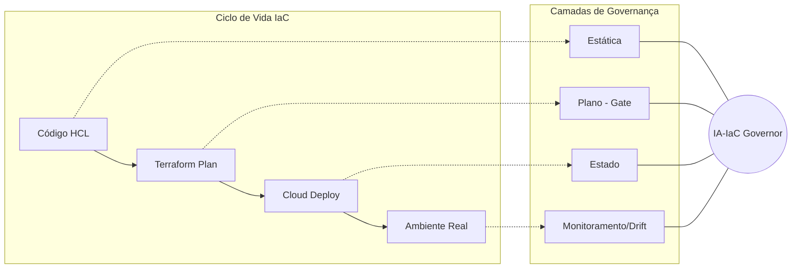

# Relatório Detalhado de Arquitetura - IA-IaC Governor

O **IA-IaC Governor** é concebido como um produto de **Engenharia de Plataforma**, focado em fornecer guardrails automatizados e governança semântica para Infraestrutura como Código (IaC).

## 1. Stack Tecnológica

A plataforma integra ferramentas líderes de mercado com orquestração de IA de última geração:

*   **Núcleo IaC:** [Terraform](https://www.terraform.io/) / [OpenTofu](https://opentofu.org/) para definição declarativa e gerenciamento de estado da infraestrutura.
*   **Orquestração de IA:** [CrewAI](https://www.crewai.com/) para gestão de agentes autônomos (Arquiteto, Auditor, Sentinel) que colaboram na resolução de problemas complexos.
*   **Motor de Políticas:** [OPA (Open Policy Agent)](https://www.openpolicyagent.org/) utilizando a linguagem **Rego** para validações rigorosas e determinísticas do Terraform Plan JSON.
*   **Integração de LLM:** [LiteLLM](https://github.com/BerriAI/litellm) para interface padronizada com diversos modelos de linguagem.
*   **Análise de Risco:** **Cloud Security Graph** (Baseado em JSON/Grafos) para mapeamento de "Combinações Tóxicas" e análise de caminhos de ataque.

## 2. Governança em Camadas

A plataforma implementa um framework de governança profunda, atuando em múltiplos estágios do ciclo de vida da infraestrutura:

1.  **Camada Estática (Pre-commit/IDE):** Captura erros de sintaxe, violações de segurança óbvias e falta de tags obrigatórias antes mesmo do código ser enviado ao repositório.
2.  **Camada de Plano (Integração CI):** A fase crítica de **Gating de Deploy**. O plano do Terraform (JSON) é analisado pelo OPA e pelos agentes de IA. Se houver violações de alta severidade, o deploy é bloqueado.
3.  **Camada de Estado (State Protection):** Garante a integridade e segurança do `terraform.tfstate`, validando que dados sensíveis estão criptografados e que o acesso ao estado é restrito.
4.  **Monitoramento Contínuo (CSPM & Drift):** O agente **Sentinel** monitora o ambiente em tempo real para detectar **Drift** (desvios) e alterações manuais ("ClickOps"), disparando alertas ou remediações automáticas.

## 3. Soberania de Infraestrutura e Custom Providers

Um diferencial estratégico da plataforma é o conceito de **Soberania de Infraestrutura**. Em vez de permitir que os desenvolvedores criem recursos sensíveis (VPCs, Roles IAM, Subnets) diretamente via SDKs de nuvem pública, a plataforma utiliza **Custom Providers** (ex: provider `governor`).

*   **Delegacia de Autoridade:** Recursos críticos são provisionados via chamadas de API para departamentos especialistas (Redes, Segurança), garantindo que as regras corporativas sejam respeitadas na origem.
*   **Plan Modification:** O provedor customizado injeta automaticamente configurações de segurança, como `permissions_boundary` em Roles IAM e condições de MFA, sem que o desenvolvedor precise conhecê-las em detalhes.

## 4. Análise de Caminho de Ataque (Security Graph)

O **Cloud Security Graph** funciona como o "Gêmeo Digital" da infraestrutura. Ele mapeia:

*   **Nós (Nodes):** Ativos (EC2, S3, IAM Roles).
*   **Arestas (Edges):** Relações de permissão, conectividade de rede e confiança.

Isso permite identificar se um erro de configuração aparentemente simples pode ser explorado para alcançar um banco de dados sensível através de múltiplos saltos de permissão.
