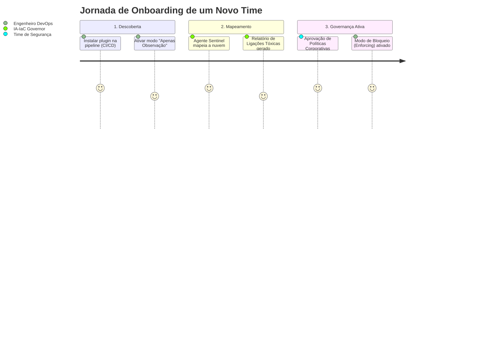
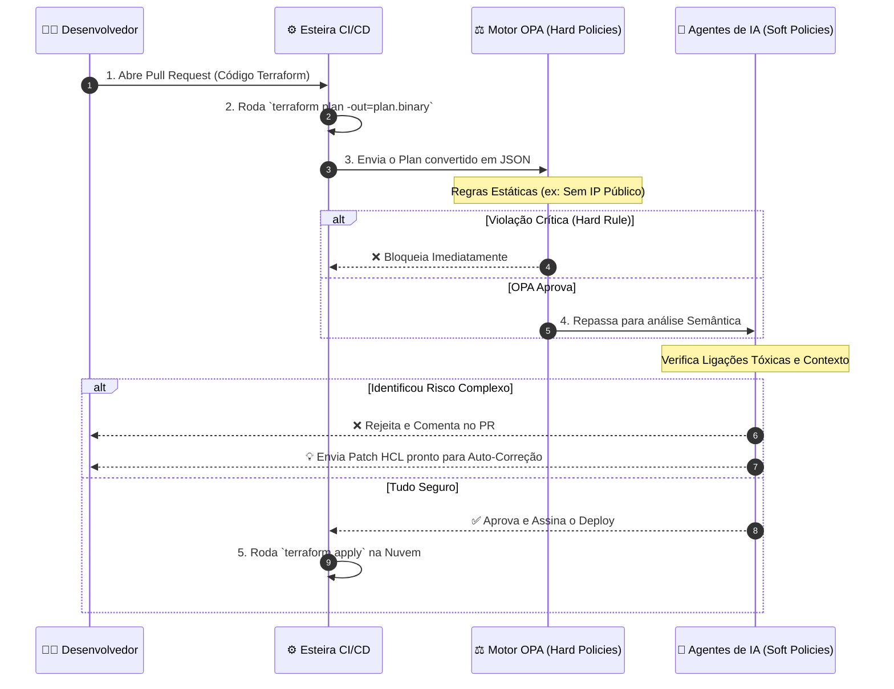
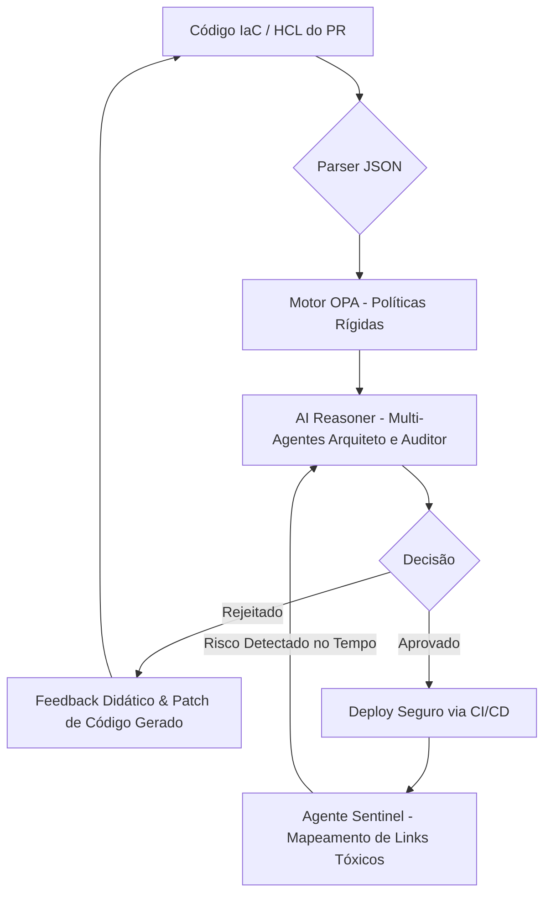

# IA-IaC Governor: Produto de Engenharia de Plataforma para Governança AI-Native

O **IA-IaC Governor** é um produto de **Engenharia de Plataforma** que fornece guardrails inteligentes e governança semântica para Infraestrutura como Código (IaC). Utilizando Inteligência Artificial (Agentes) e políticas baseadas em código (OPA), a plataforma audita, corrige e garante a conformidade da sua infraestrutura de forma automatizada.

Diferente de ferramentas tradicionais, o Governor analisa não só a sintaxe, mas a **intenção** do código, garantindo que a infraestrutura seja segura, econômica e resiliente por design.

---

## 🚀 Onboarding: Como uma nova equipe adota a plataforma

O processo de adoção (*Onboarding*) foi desenhado para ser sem atrito, focando em trazer segurança sem travar o time de desenvolvimento. 



1. **Instalação Plug & Play:** Apenas um container ou hook é adicionado na pipeline de CI/CD existente (GitHub Actions, GitLab CI, etc).
2. **Modo Sombra (Shadow Mode):** No início, o Governor apenas escuta os `terraform plan`, avisando sobre vulnerabilidades sem bloquear deploys (evita atrito inicial).
3. **Mapeamento de Baseline:** O Agente Sentinel varre a conta em busca de recursos legados e ligações tóxicas.
4. **Governança Ativa (Enforcing):** Quando o time está maduro, o bloqueio de PRs é ativado e a IA passa a sugerir patches de correção automáticos.

---

## 🛡️ Fluxo Visual de Validação (Dia-a-Dia)

Veja visualmente como a plataforma intercepta e valida uma alteração de infraestrutura feita por um desenvolvedor no dia-a-dia:



---

### ⚖️ O Papel de Cada Motor: Determinístico vs. IA e Grafos

A estratégia de governança do Governor é dividida em dois domínios complementares:

1. **O Domínio Determinístico (OPA, Checkov, tfsec):**
   * **Foco:** Validação de atributos isolados e sintaxe.
   * **Exemplos:** "A porta 22 está aberta?", "O bucket S3 tem versionamento?", "A tag `Owner` existe?".
   * **Vantagem:** São ferramentas extremamente rápidas, exatas e baratas para regras inflexíveis (Hard Policies).

2. **O Domínio de IA e Grafos (LLM + Infrastructure Graph):**
   * **Foco:** Contexto, topologia e semântica. O LLM **não** avalia a sintaxe do Terraform (HCL).
   * **Exemplos:** Entender que uma porta 22 aberta só é crítica se a máquina possui uma Role que escreve no KMS de Produção.
   * **Vantagem:** O valor da IA está em interpretar topologias complexas, correlacionar eventos e explicar o "porquê" do risco em linguagem natural (Blast Radius e Combinações Tóxicas), baseando-se em queries executadas contra um Grafo de Infraestrutura determinístico.

---

## 🎯 Para que serve: O que consegue e o que NÃO consegue atender

Para alinhar expectativas sobre o papel do IA-IaC Governor na sua arquitetura, veja claramente suas responsabilidades:

### ✅ O que a plataforma CONSEGUE fazer
* **Bloquear Deploys Inseguros:** Impede que vulnerabilidades ou más práticas cheguem em produção.
* **Corrigir Código Automaticamente (Auto-Remediation):** Sugere ou gera o código exato em HCL/Terraform para corrigir uma violação detectada.
* **Garantir Compliance Total:** Valida políticas corporativas ("Hard Policies" via OPA) e regras baseadas em contexto ("Soft Policies" via IA).
* **Detectar "Drift" de Infraestrutura:** Monitora o ambiente real para garantir que o que está rodando bate com o código (via Agente Sentinel).
* **Calcular Impacto Financeiro (FinOps):** Estima os custos do plano antes do deploy para evitar surpresas na fatura da nuvem.

### ❌ O que a plataforma NÃO consegue (e não deve) fazer
* **Não é uma ferramenta de Deploy:** O Governor não executa `terraform apply` ou sobe a infraestrutura. Ele apenas audita e libera o caminho; o deploy final continua a cargo do seu CI/CD (Github Actions, Jenkins, etc).
* **Não escreve o projeto do zero:** O desenvolvedor ainda precisa criar a arquitetura base (a lógica de negócios da infra). O Governor atua como um revisor/engenheiro sênior.
* **Não substitui a Nuvem (AWS, GCP, Azure):** Ele valida as requisições para a nuvem, não hospeda recursos.

---

## 📊 Certificações de Segurança e Normas Atendidas

Ao utilizar a plataforma de governança do IA-IaC Governor em sua pipeline, **sua infraestrutura e provisionamento estarão automaticamente homologados e em conformidade** com os principais benchmarks, certificações e normas do mercado. 

As políticas (Rego + IA) cobrem as seguintes normas:

| Certificadora / Norma | O que a plataforma garante (Como resolve) |
| :--- | :--- |
| **CIS AWS Foundations Benchmark** | Bloqueia configurações inseguras por padrão (ex: bloqueia SG com porta 22 aberta para `0.0.0.0/0`, garante logs do CloudTrail ativos). |
| **NIST SP 800-53** | Garante criptografia de dados em repouso e em trânsito em todos os serviços (RDS, S3, EBS). Injeta regras de criptografia via OPA. |
| **PCI-DSS** | Isola o ambiente de processamento de cartões e garante o *Princípio de Menor Privilégio* para IAM Roles, validando restrições de rede estritas. |
| **SOC 2 (Type II)** | Mantém o registro (logs de auditoria) inalterável de todas as aprovações/rejeições de infraestrutura e previne mudanças manuais em produção (ClickOps). |
| **ISO 27001** | Aplica gestão de riscos automatizada no deploy, validando configurações de acesso e políticas de retenção de dados. |
| **HIPAA / GDPR / LGPD** | Impede exposição de dados sensíveis na internet (ex: buckets S3 públicos) e exige anonimização e regras de retenção em bancos de dados. |

---

## 🕸️ Mapeamento de Recursos e Prevenção de Ligações Tóxicas

Com o tempo, infraestruturas na nuvem crescem e ficam difíceis de rastrear. O IA-IaC Governor utiliza o **Agente Sentinel** para atuar de forma inteligente criando um mapa dinâmico.

* **Security Graph (Mapa de Recursos):** O Agente constrói um grafo de conhecimento da sua nuvem, mapeando como recursos se conectam (ex: qual Role tem acesso a qual Bucket S3, que está atrelado a qual EC2).
* **Detecção de Ligações Tóxicas (Toxic Combinations):** Muitas vulnerabilidades não existem em um único recurso isolado, mas na combinação deles. O Governor identifica cenários tóxicos.
  * *Exemplo:* Uma EC2 conectada à internet (com IP público) + Uma IAM Role atrelada a ela com permissões de administrador no S3. O agente alerta e bloqueia a "ligação tóxica", mesmo que os dois recursos isoladamente pareçam normais.
* **Evolução Contínua:** Ao longo do tempo, o mapa evolui, monitorando *drifts* (desvios entre o Terraform e o Console AWS) e blindando o ambiente ativamente contra caminhos de ataque.

---

## 🏗️ Arquitetura e Ciclo de Feedback

O fluxo da plataforma opera em um ciclo contínuo de validação e correção automática.



---

## 🚦 Como Testar e Executar a POC

### 1. Pré-requisitos
- Python 3.10+
- [OPA (Open Policy Agent)](https://www.openpolicyagent.org/docs/latest/#1-download-opa) instalado no seu PATH.

### 2. Instalação
```bash
pip install -r requirements.txt
```

### 3. Simulações Inclusas
O repositório inclui cenários simulados para demonstração:
- **POC Completa:** `python3 simulate_poc.py`
- **Detecção de Drift & Mapas:** `python3 simulate_drift.py`
- **Soberania de Infra:** `python3 simulate_sovereignty.py`

---

## 🤝 Contribuição

Encorajamos a contribuição de novos módulos e políticas OPA. Veja nosso [**Guia de Contribuição**](CONTRIBUTING.md) para aprender sobre como criar novos Golden Paths e participar do projeto.
