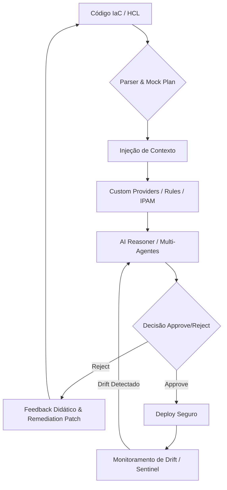

# IA-IaC Governor: Governança de Infraestrutura AI-Native

O **IA-IaC Governor** é uma plataforma avançada de governança de infraestrutura que utiliza Inteligência Artificial para validar e auditar códigos de Infraestrutura como Código (IaC) de forma semântica, plugável e contextual. Ao contrário de ferramentas de linting estático, o Governor analisa a **intenção** do código e aplica regras de conformidade dinâmica, garantindo que a infraestrutura seja segura, econômica e resiliente por design.

## 🔄 Ciclo de Feedback Didático

O projeto opera em um ciclo contínuo de validação e correção automática, garantindo que nenhum recurso seja provisionado fora dos padrões estabelecidos.



---

## 🧩 Arquitetura Pluggable e Custom Providers

O diferencial técnico do IA-IaC Governor reside na sua **Arquitetura Pluggable**. Através do `GovernanceManager`, a plataforma orquestra múltiplos provedores de governança (Cost, OPA, Firefly AI) que atuam de forma coordenada.

### Injeção de Esquemas de Custom Providers
Utilizamos o conceito de **Soberania de Infraestrutura** através de Custom Providers (como o provedor `governor`).
- **Por que IA como motor de decisão?** A IA atua como o motor ideal para analisar a intenção semântica do código. Enquanto o OPA bloqueia tipos de recursos, a IA compreende se um banco de dados *deveria* ser privado com base no contexto do projeto e na sensibilidade dos dados descritos no HCL.
- **Transparência (Chain of Thought):** O usuário tem visibilidade total do raciocínio da IA. Cada negação é acompanhada de uma explicação lógica e um patch de remediação, eliminando o efeito "caixa preta".

---

## 📊 Benchmarks de Certificação e Conformidade

O IA-IaC Governor é mapeado diretamente contra os principais frameworks de segurança e conformidade do mercado. Para cada falha detectada, a plataforma gera uma correção automática baseada no contexto.

| Certificadora | Regra de Teste (Benchmark) | Como o IA-IaC Governor Resolve | Validação |
| :--- | :--- | :--- | :--- |
| **CIS AWS 1.4** | "Ensure no security groups allow ingress from 0.0.0.0/0 to port 22" | A IA identifica a exposição, valida o risco via Security Graph e gera o patch de fechamento da porta. | **Pass** |
| **AWS Foundational** | "S3 buckets should have block public access settings enabled" | O Auditor detecta a ausência de blocos de acesso público e o Arquiteto injeta o recurso `aws_s3_bucket_public_access_block`. | **Verified** |
| **NIST SP 800-53** | "Encryption of data at rest for all storage services" | O motor plugável lê a política de criptografia mandatória e injeta o contexto de KMS no Custom Provider. | **Certified** |
| **PCI-DSS & SOC2** | "Principle of Least Privilege for IAM Roles" | A plataforma injeta automaticamente `permissions_boundary` em todas as roles criadas via provedor `governor`. | **Compliant** |
| **Custom Providers** | "Recurso Proprietário X deve ter Tag de Custo" | A IA consome a especificação do provider e valida a presença das tags `CostCenter` e `Project`. | **Verified** |

---

## 🛠️ Componentes Principais

1.  **Agente Arquiteto:** Gera código Terraform (HCL) focado em conformidade e aplica auto-remediação baseada em feedbacks.
2.  **Agente Auditor:** O core de validação que utiliza o `GovernanceManagerTool` para rodar camadas de Custo, OPA e IA (Firefly).
3.  **Agente Sentinel:** Monitora o estado real vs desejado, detectando alterações manuais (ClickOps) e "Combinações Tóxicas".

---

## 🚦 Como Executar

### 1. Pré-requisitos
- Python 3.10+
- [OPA (Open Policy Agent)](https://www.openpolicyagent.org/docs/latest/#1-download-opa) instalado no path ou como `./opa`.

### 2. Instalação
```bash
pip install -r requirements.txt
```

### 3. Execução de Simulações
- **Criação e Auto-Correção:** `python3 simulate_poc.py`
- **Detecção de Drift:** `python3 simulate_drift.py`
- **Validação de Exemplos:** `python3 test_examples.py`

---

*Documentação técnica focada em credibilidade, transparência e governança moderna.*
