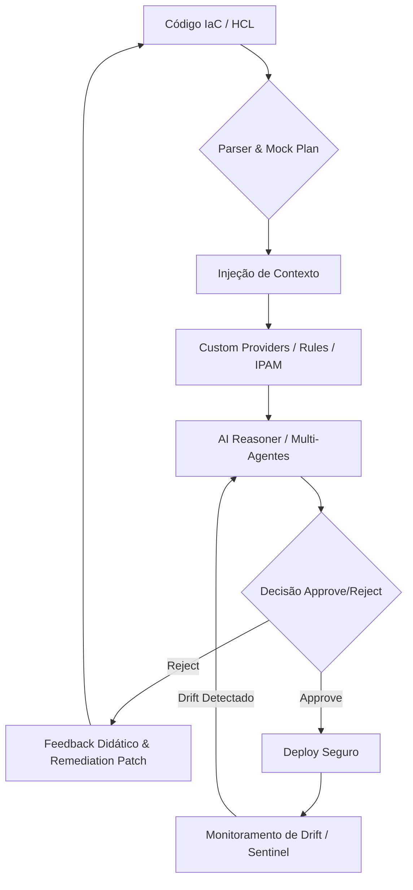

# IA-IaC Governor: Produto de Engenharia de Plataforma para Governança AI-Native

O **IA-IaC Governor** não é apenas um script de validação, mas um produto completo de **Engenharia de Plataforma**. Ele fornece guardrails inteligentes e governança semântica para Infraestrutura como Código (IaC), utilizando Inteligência Artificial para auditar e automatizar a conformidade de forma plugável e contextual.

Diferente de ferramentas tradicionais, o Governor analisa a **intenção** do código e aplica políticas dinâmicas, garantindo que a infraestrutura seja segura, econômica e resiliente por design.

---

## 🎯 Casos de Uso e Problemas Resolvidos

A plataforma valida cenários reais de governança através de múltiplas estratégias:

| Categoria | Caso de Uso | Problema Resolvido | Estratégia de Governança |
| :--- | :--- | :--- | :--- |
| **PCI-DSS** | Criptografia Mandatória | Vazamento de dados em repouso por falta de criptografia | OPA + Análise de Plan JSON |
| **Networking** | IPAM Automático | Conflitos de rede e sobreposição de CIDR | Custom Provider + API de Redes |
| **FinOps** | Limite de Gasto ($100) | Orçamento estourado sem aviso prévio | OPA + Estimativa de Custo Real |
| **Segurança** | Princípio do Privilégio Mínimo | IAM Roles excessivamente permissivas | Injeção Automática de Permissions Boundary |
| **Dia 2** | Detecção de ClickOps | Alterações manuais inseguras via Console | Drift Detection via Agente Sentinel |

---

## 🏗️ Arquitetura e Stack Técnica

A plataforma é construída sobre uma stack moderna e modular:

*   **Núcleo IaC:** Terraform/OpenTofu.
*   **Orquestração de IA:** CrewAI (Multi-agentes: Arquiteto, Auditor, Sentinel).
*   **Motor de Políticas:** Open Policy Agent (OPA) com linguagem Rego.
*   **Análise de Risco:** Cloud Security Graph para identificação de caminhos de ataque.

> Para detalhes profundos sobre o funcionamento interno, veja o [**Relatório de Arquitetura**](ARCHITECTURE.md).

---

## 🔄 Ciclo de Feedback Didático

O Governor opera em um ciclo contínuo de validação e correção automática.



---

## 🛡️ Soberania de Infraestrutura

Através do uso de **Custom Providers** (ex: provedor `governor`), a plataforma implementa a Soberania de Infraestrutura.
- Recursos sensíveis (VPC, IAM, Subnets) não são criados diretamente pelo desenvolvedor.
- O Governor atua como um proxy que delega a criação para departamentos especialistas via API.
- **Vantagem:** Regras corporativas são injetadas automaticamente na origem (Plan Modification).

---

## 🧩 Componentes Principais

1.  **Agente Arquiteto:** Gera código HCL conforme e aplica patches de auto-remediação.
2.  **Agente Auditor:** Orquestra o `GovernanceManager` (Custo, OPA, Segurança).
3.  **Agente Sentinel:** Monitora o estado real e detecta drifts ou "Combinações Tóxicas".
4.  **Governance Manager:** Motor plugável que permite ativar/desativar camadas de conformidade.

---

## 🚦 Como Executar

### 1. Pré-requisitos
- Python 3.10+
- [OPA (Open Policy Agent)](https://www.openpolicyagent.org/docs/latest/#1-download-opa) instalado no path.

### 2. Instalação
```bash
pip install -r requirements.txt
```

### 3. Simulações
- **POC Completa:** `python3 simulate_poc.py`
- **Detecção de Drift:** `python3 simulate_drift.py`
- **Soberania de Infra:** `python3 simulate_sovereignty.py`

---

## 🤝 Contribuição e Caminhos Dourados (Golden Paths)

Encorajamos a contribuição de novos módulos e políticas. Veja nosso [**Guia de Contribuição**](CONTRIBUTING.md) para aprender sobre como criar novos Golden Paths e participar do projeto.
