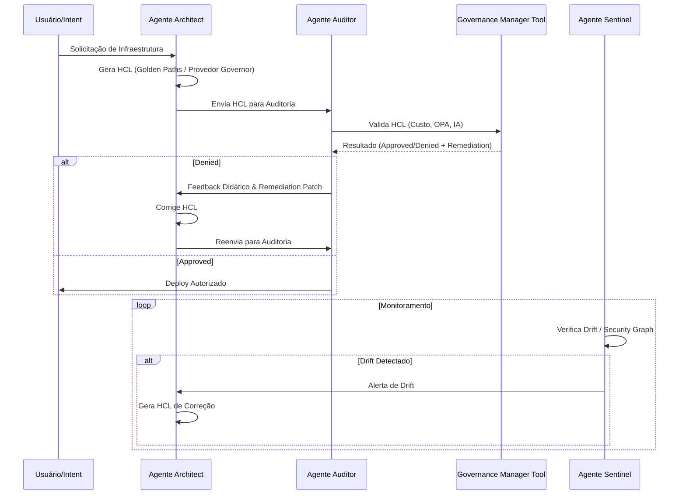

# 🤖 Agentes de Governança

Esta pasta contém as definições dos agentes e tarefas baseados no framework **CrewAI**, responsáveis pela orquestração inteligente da governança de infraestrutura.

## 👥 Agentes Principais

- **Architect (Arquiteto):** Responsável por gerar código HCL seguro e em conformidade, utilizando Golden Paths e Custom Providers.
- **Auditor (Auditor):** Realiza a auditoria técnica do código gerado, utilizando o `GovernanceManagerTool` para validar camadas de custo, conformidade e segurança.
- **Sentinel (Sentinela):** Monitora o ambiente em busca de drifts (desvios) e combinações tóxicas de recursos.

## 🔄 Fluxo de Trabalho

O diagrama abaixo ilustra como os agentes interagem durante o ciclo de vida de uma solicitação de infraestrutura.

## 📄 Arquivos

- `agents.py`: Definição das classes, papéis (roles), objetivos (goals) e ferramentas (tools) de cada agente.
- `tasks.py`: Definição das tarefas específicas executadas pelos agentes, incluindo descrição e saída esperada.
