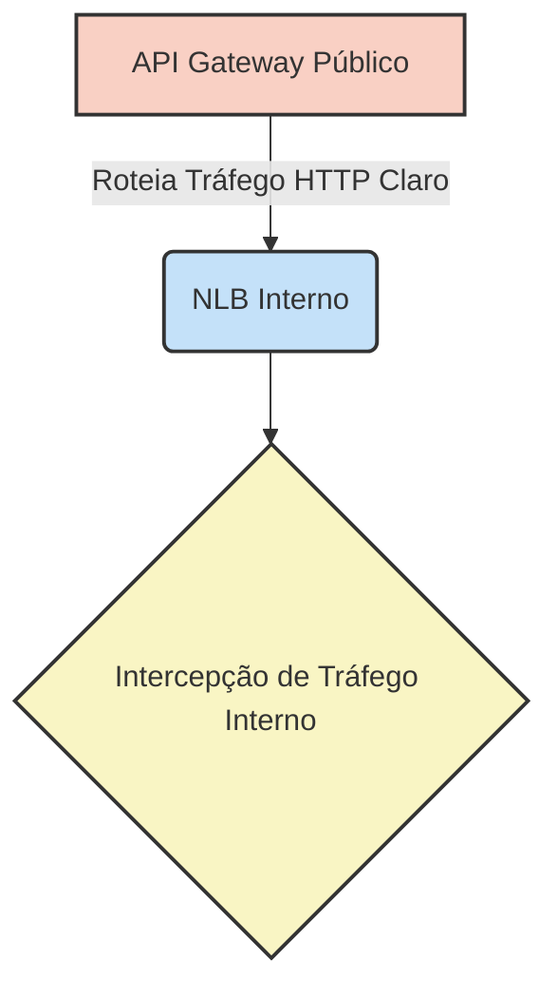

# Caminho do Ataque: 02 Api Gateway Vpc Link Exfiltration

Este diagrama ilustra a topologia da vulnerabilidade e o caminho causal que o Agente IA-IaC Governor detecta.

```mermaid
graph TD
    classDef attacker fill:#f9d0c4,stroke:#333,stroke-width:2px;
    classDef target fill:#c4e1f9,stroke:#333,stroke-width:2px;
    classDef impact fill:#f9f5c4,stroke:#333,stroke-width:2px;

    A[API Gateway Público]:::attacker -->|Roteia Tráfego HTTP Claro| B(NLB Interno):::target
    B --> C{Intercepção de Tráfego Interno}:::impact
```
