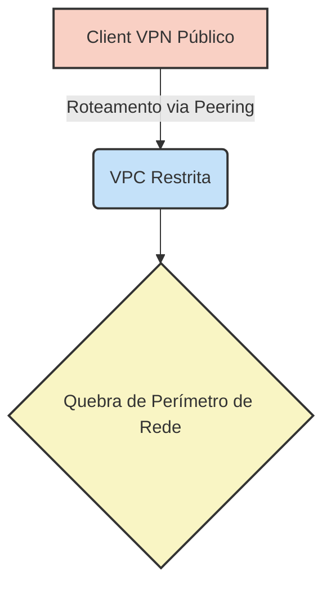

# Caminho do Ataque: 03 Boundary Protection Bypass

Este diagrama ilustra a topologia da vulnerabilidade e o caminho causal que o Agente IA-IaC Governor detecta.

```mermaid
graph TD
    classDef attacker fill:#f9d0c4,stroke:#333,stroke-width:2px;
    classDef target fill:#c4e1f9,stroke:#333,stroke-width:2px;
    classDef impact fill:#f9f5c4,stroke:#333,stroke-width:2px;

    A[Client VPN Público]:::attacker -->|Roteamento via Peering| B(VPC Restrita):::target
    B --> C{Quebra de Perímetro de Rede}:::impact
```
