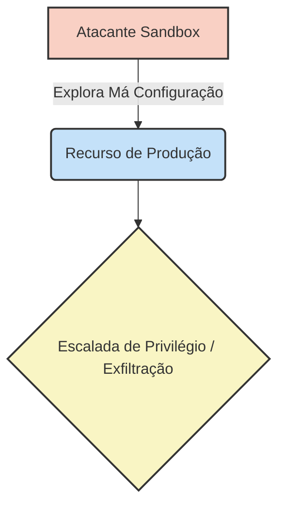

# Caminho do Ataque: 07 Mfa Bypass Ip Spoofing

Este diagrama ilustra a topologia da vulnerabilidade e o caminho causal que o Agente IA-IaC Governor detecta.

```mermaid
graph TD
    classDef attacker fill:#f9d0c4,stroke:#333,stroke-width:2px;
    classDef target fill:#c4e1f9,stroke:#333,stroke-width:2px;
    classDef impact fill:#f9f5c4,stroke:#333,stroke-width:2px;

    A[Atacante Sandbox]:::attacker -->|Explora Má Configuração| B(Recurso de Produção):::target
    B --> C{Escalada de Privilégio / Exfiltração}:::impact
```
