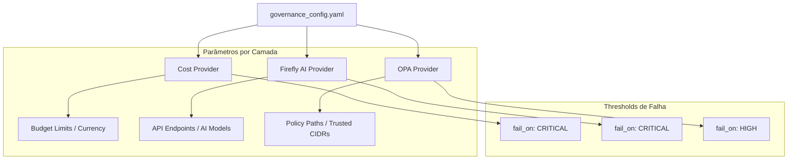

# ⚙️ Configuração de Governança

Esta pasta contém as definições de configuração que controlam o comportamento do motor de governança.

## 🛠️ O Arquivo `governance_config.yaml`

O arquivo `governance_config.yaml` é o ponto central para ativar, desativar e parametrizar as camadas de conformidade. Ele permite definir o nível de severidade que causará a interrupção (falha) do pipeline.

### Estrutura da Configuração

## 📋 Atributos Principais

- **`name`**: Nome do provedor de governança (`cost`, `opa`, `firefly`).
- **`enabled`**: Booleano para ativar/desativar a camada.
- **`fail_on`**: Nível de severidade mínima que interrompe o deploy (`LOW`, `MEDIUM`, `HIGH`, `CRITICAL`).
- **`params`**: Dicionário de parâmetros específicos para cada provedor (ex: caminhos de políticas, limites de custo).
