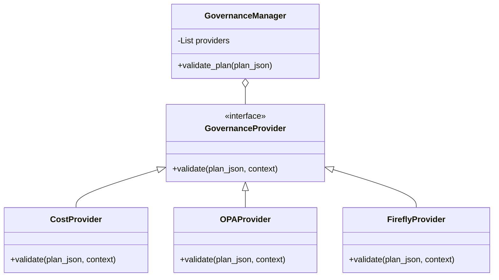
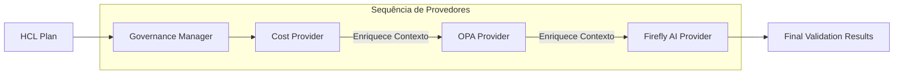

# ⚖️ Motor de Governança Plugável

Este módulo é o coração do sistema de auditoria do IA-IaC Governor. Ele utiliza o **Strategy Pattern** para permitir que múltiplas camadas de governança sejam executadas de forma sequencial e coordenada.

## 🏗️ Arquitetura do Motor

O motor é composto por três componentes principais:

1.  **`base.py` (Abstrações):** Define as interfaces `GovernanceProvider` e as estruturas de dados `ValidationResult` e `ValidationFinding` utilizando Pydantic.
2.  **`manager.py` (Orquestrador):** O `GovernanceManager` lê a configuração YAML, carrega os provedores ativos e executa a validação do plano HCL.
3.  **`providers/` (Implementações):** Contém os plug-ins específicos para cada domínio de governança (Cost, OPA, Firefly).

## 🛠️ Padrão Strategy (Estratégia)

O uso do padrão Strategy permite que o motor de governança seja facilmente estendido com novos tipos de validação sem modificar o código do orquestrador.

## 🔄 Fluxo de Validação Contextual

Diferente de validadores isolados, o `GovernanceManager` mantém um **Contexto Compartilhado** (Dicionário) que é passado entre os provedores. Isso permite, por exemplo, que o `OPAProvider` tome decisões baseadas no custo estimado calculado anteriormente pelo `CostProvider`.

## 📄 Arquivos Principais

- `base.py`: Modelos de dados (Pydantic) e classes base abstratas.
- `manager.py`: Lógica de carregamento de configuração e orquestração de execução.
- `providers/`: Implementações concretas das regras de governança.
