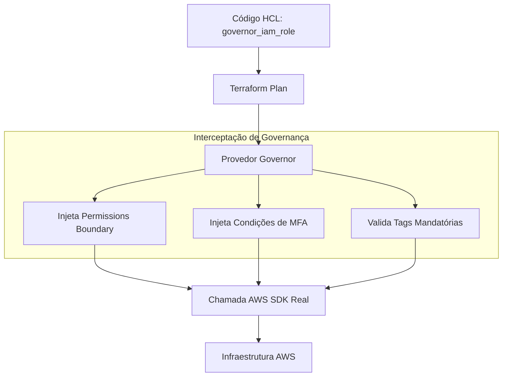

# 🏛️ Soberania de Infraestrutura: Provedor 'governor'

Este diretório contém a implementação do **Custom Terraform Provider** escrito em Go, uma peça fundamental para garantir a Soberania de Infraestrutura da organização.

## 🛡️ O Conceito de Soberania

Em vez de permitir que os desenvolvedores utilizem diretamente os recursos nativos da AWS (como `aws_vpc` ou `aws_iam_role`), a organização impõe o uso do provedor `governor`. Isso cria uma camada de abstração e controle onde a governança é **nativa por design**.

## 🔄 Funcionamento e Interceptação

O provedor `governor` não é apenas um "wrapper". Ele atua como um gatekeeper que intercepta a intenção de criação de recursos e injeta automaticamente configurações mandatórias.

## 🚀 Benefícios do Provedor Customizado

1.  **Imposição de Políticas:** Garante que recursos críticos (VPC, IAM, Security Groups) nunca sejam criados sem os controles de segurança corporativos.
2.  **Injeção Automática de Contexto:** Reduz a carga cognitiva dos desenvolvedores, pois o provedor cuida de detalhes como `permissions_boundary` e regras de rede padrão.
3.  **Auditoria Centralizada:** Todas as criações de recursos via `governor` podem ser rastreadas e validadas contra APIs internas de Redes e Segurança antes mesmo de tocar na AWS.

## 📄 Estrutura do Código

- `main.go`: Ponto de entrada do plugin do Terraform.
- `internal/provider/`: Implementação da lógica do provedor, definição de recursos (`governor_vpc`, `governor_subnet`, etc.) e esquemas de dados.
