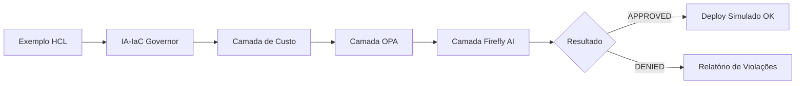

# 💡 Exemplos e Casos de Uso

Esta pasta contém cenários práticos de Infraestrutura como Código (IaC) que demonstram as capacidades de governança do IA-IaC Governor.

## 📂 Organização dos Exemplos

- **`pci_compliance/`**: Exemplos de recursos que lidam com dados sensíveis de cartões, exigindo criptografia e isolamento total.
- **`finops_control/`**: Cenários focados em controle de custos, demonstrando o bloqueio de recursos que excedem o orçamento ou que não possuem tags de centro de custo.
- **`iam_guardrails/`**: Demonstração do uso do provedor `governor` para criar roles com `permissions_boundary` automático.
- **`day2_drift/`**: Cenários para testar a detecção de desvios (drift) entre o estado real e o definido no código.
- **`golden_paths/`**: Exemplos de uso dos módulos padronizados para aplicações comuns.

## 🔄 Fluxo de Validação de Exemplo

Cada exemplo nesta pasta pode ser submetido ao motor de governança para validar o comportamento esperado (Aprovação ou Rejeição).



## 🚀 Como Testar

Para validar todos os exemplos automaticamente contra os vereditos esperados, execute o script:

```bash
python3 test_examples.py
```
