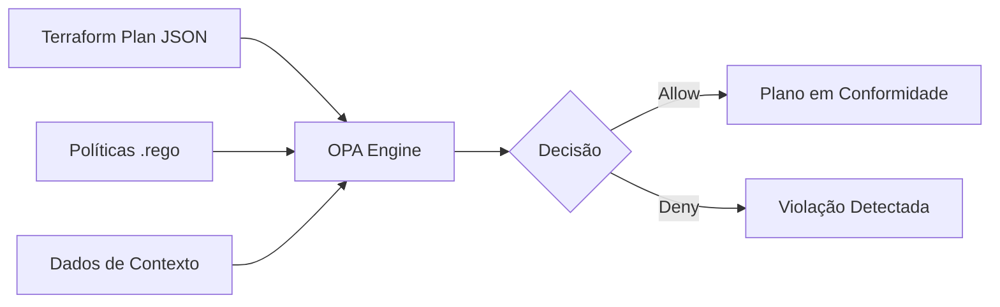

# 📜 Políticas de Conformidade (OPA)

Este diretório contém as políticas de governança escritas em **Rego**, utilizadas pelo **Open Policy Agent (OPA)** para realizar a validação estática e semântica do plano de infraestrutura.

## ⚖️ O papel do OPA

O OPA atua como um motor de decisão de propósito geral. No contexto do IA-IaC Governor, ele é responsável por garantir que as regras de conformidade "hard" (invioláveis) sejam respeitadas.

## 🔄 Fluxo de Avaliação

O processo de avaliação transforma o plano do Terraform em uma decisão de aprovação ou negação.



## 🛠️ Políticas Implementadas

As políticas atuais em `compliance.rego` focam em:

1.  **Soberania de Recursos:** Bloqueio do uso de recursos nativos da AWS (`aws_vpc`, `aws_iam_role`, etc.) em favor dos equivalentes do provedor `governor`.
2.  **Segurança de Rede:** Restrição de CIDRs autorizados para Security Groups.
3.  **Segurança de Dados:** Obrigatoriedade de criptografia para buckets S3 e bancos de dados RDS.
4.  **Least Privilege:** Verificação de permissões administrativas excessivas.

## 🚦 Como Testar Localmente

Você pode testar as políticas utilizando o binário do `opa`:

```bash
./opa eval -i plan.json -d policies/compliance.rego "data.compliance.deny"
```
