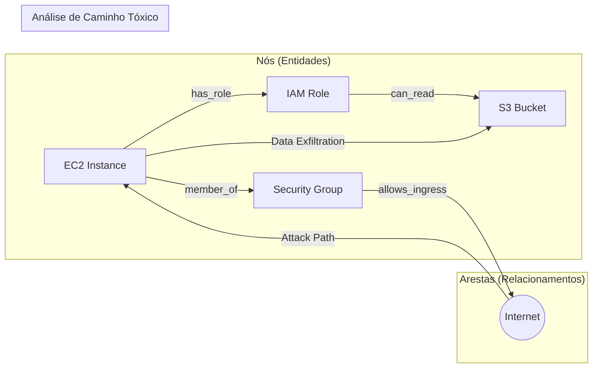

# Cloud Security Graph: O Gêmeo Digital da Infraestrutura

O arquivo `security_graph.json` define o esquema de dados para o **Cloud Security Graph**. Este modelo é o alicerce para uma governança moderna e preditiva, permitindo visualizar a infraestrutura como um **Gêmeo Digital** (Digital Twin) interconectado.

## 1. Por que um Grafo?

Diferente de listas estáticas de recursos, o grafo permite enxergar a infraestrutura através dos olhos de um atacante. Ele revela como configurações isoladas podem se combinar para criar vulnerabilidades sistêmicas.

### Componentes do Esquema:
*   **Nós (Nodes - O "Quê"):** Ativos como EC2, S3, Roles IAM e Subnets. Cada nó contém metadados de criticidade e estado de conformidade.
*   **Arestas (Edges - O "Como"):** Relações de confiança, permissões IAM e conectividade de rede.

## 2. Identificação de "Combinações Tóxicas"

O grafo é essencial para identificar riscos que ferramentas de linting ignoram.

**Exemplo de Combinação Tóxica:**
- Uma instância EC2 está em uma **Subnet Pública** (Nó A -> Nó B).
- Essa instância possui uma **Role IAM** com acesso total ao S3 (Nó A -> Nó C).
- **Risco:** Um atacante que comprometa a instância pode exfiltrar dados sensíveis imediatamente.

## 3. Análise de Caminho de Ataque (Attack Path Analysis)

A plataforma utiliza o grafo para realizar análises de múltiplos saltos (multi-hop). Isso permite prever se uma alteração proposta no código IaC criará um novo caminho que ligue um ponto de entrada exposto (Internet) a um ativo crítico (Banco de Dados PCI).

## 4. Integração com IA e OPA

- **Simulação "What-if":** A IA simula mudanças no grafo antes do deploy real.
- **Validação Programática:** Regras em Rego (OPA) consultam a estrutura do grafo para bloquear deploys que aumentem o risco de segurança lateral.

---

*O Cloud Security Graph transforma a auditoria de uma tarefa reativa em uma estratégia de redução proativa de riscos.*
