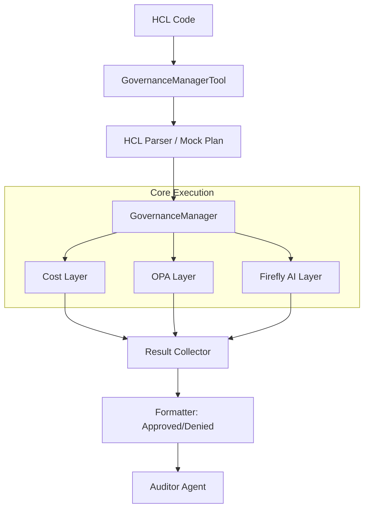

# 🛠️ Workflow e Ferramentas (Tools)

Este diretório contém as ferramentas customizadas que os agentes do CrewAI utilizam para interagir com o motor de governança e com o inventário de rede.

## 🧰 Ferramentas Principais

- **`GovernanceManagerTool`**: A ferramenta mais importante. Ela serve como a ponte entre o Agente Auditor e o motor de governança (`core/governance`). Ela recebe o código HCL, gera um "mock plan" e executa todas as camadas de validação.
- **`NetworkInventoryTool`**: Utilizada pelo Agente Architect para consultar o IPAM (simulado no `security_graph.json`) e obter CIDRs disponíveis para novas subnets.

## 🔄 Fluxo de Execução da `GovernanceManagerTool`

A `GovernanceManagerTool` encapsula a complexidade de instanciar o motor de governança e processar os resultados para os agentes.

## 📄 Arquivos

- `tools.py`: Implementação das classes que herdam de `BaseTool` do CrewAI. Define o nome, descrição e a lógica de execução (`_run`) de cada ferramenta.
